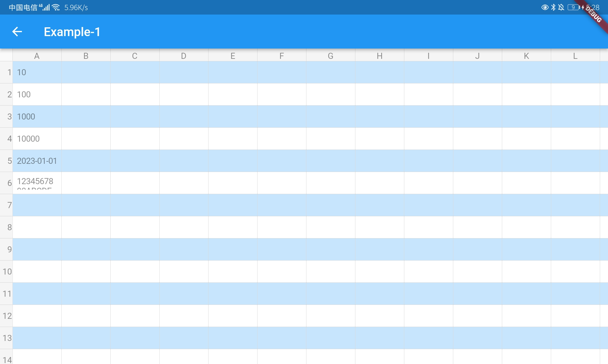
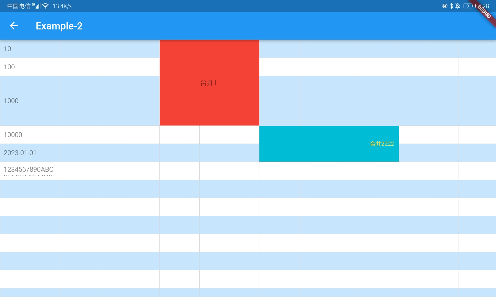
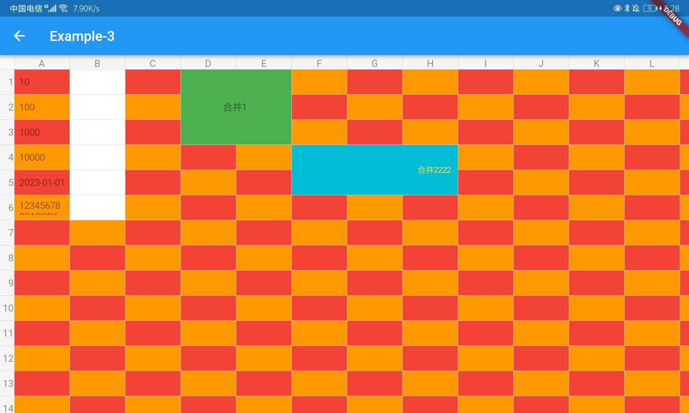
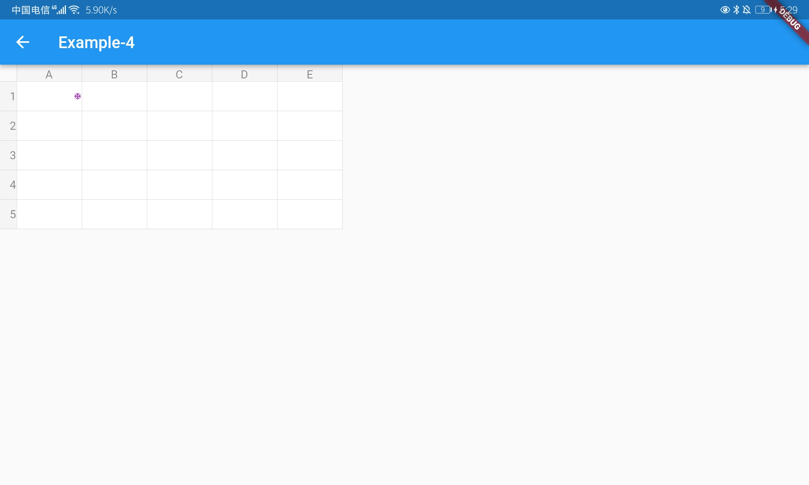

# flutter_excel_table

[](https://pub.dartlang.org/packages/flutter_excel_table)


Language: English | [简体中文](README-ZH.md)

### Add dependencies to your project

```yaml
dependencies:
  flutter:
    sdk: flutter

  flutter_excel_table: ^latestVersion
```

### Install

```shell
$ flutter pub get
```

### Import

```dart
import 'package:flutter_excel_table/flutter_excel_table.dart';
```

### CHANGELOG
- [CHANGELOG](./CHANGELOG.md)

### Usage

```dart
FlutterExcelWidget<ExcelExampleModel>(
  excel: ExcelModel(
    x: 16,
    y: 16,
    showSn: true,
    backgroundColor: Colors.white,
    rowColor: Colors.blue.withOpacity(.25),
    positionColor: (int x, int y) => y % 2 == 0,
  ),
  items: [
    ExcelItemModel(
      position: ExcelPosition(5, 3),
      value: ExcelExampleModel(value: '合并2222'),
      color: Colors.cyan,
      textAlign: TextAlign.end,
      isReadOnly: true,
      isMergeCell: true,
      style: const TextStyle(fontSize: 12, color: Colors.amberAccent),
      positions: [
        ExcelPosition(5, 3),
        ExcelPosition(5, 4),
        ExcelPosition(6, 3),
        ExcelPosition(6, 4),
        ExcelPosition(7, 3),
        ExcelPosition(7, 4),
      ],
    ),
    ExcelItemModel(
      position: ExcelPosition(0, 0),
      value: ExcelExampleModel(value: '10'),
      isReadOnly: true,
    ),
    ExcelItemModel(
      position: ExcelPosition(0, 1),
      value: ExcelExampleModel(value: '100'),
      inputType: ExcelInputType.date,
    ),
  ],
  onItemClicked: (items, item) {},
  onItemChanged: (items, item, value) {},
)
```

[More Example](./example/lib/main.dart)

### Example

#### Example-1


#### Example-2


#### Example-3


#### Example-4


